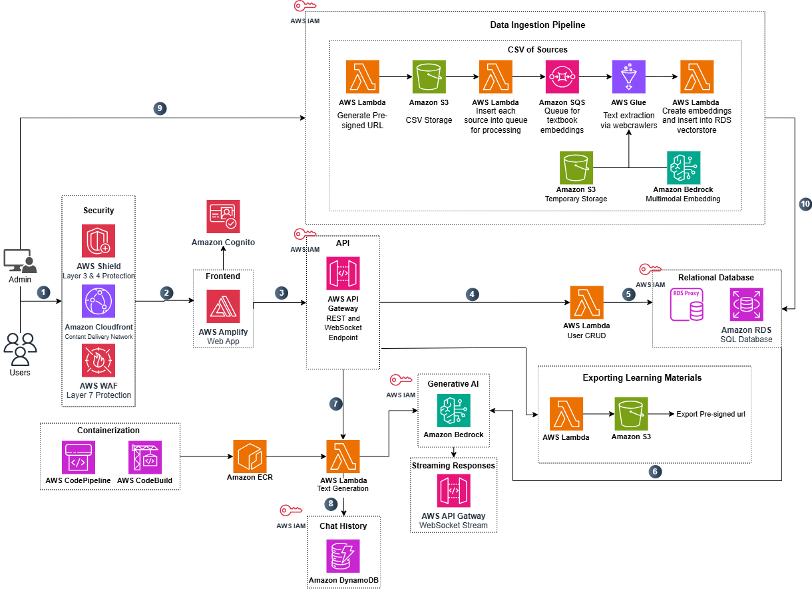

# Architecture Deep Dive

## Architecture



1. The user request is first sent through a security layer which comprises of AWS WAF, Amazon CloudFront, and AWS Shield for flagging any potential threats.

2. Users access the application through a React frontend hosted on AWS Amplify. AWS Cognito handles user authentication for admins, ensuring that only authorized administrators are able to access admin analytics and features. As for public users, there is no authentication in order to retain anonymity.

3. The frontend communicates with backend services via REST API (API Gateway → Lambda) for CRUD operations, user management, and textbook-specific operations. Access is controlled using IAM roles and policies to ensure secure access to the services required to retain functionality. The WebSocket endpoint is used to stream live responses generated from the LLM to the user's frontend.

4. User interactions, chat sessions, and practice materials are all stored in Amazon RDS via RDS Proxy and connection pooling to optimize database connections and secure all application specific information.

5. When users query the chat assistant in a chat session, the application utilizes RAG (Retrieval-Augmented Generation) by searching for relevant textbook specific context using a vector similarity search. The retrieved pieces of text are the most semantically important pieces of text from the chapter to answer the user's question.

6. Amazon Bedrock processes the user query alongside the retrieved pieces of textbook context to generate a response using a foundational model whilst tracking sources (such as textbook chapter URLs) to provide users with a response with the sources it used to create this response.

7. Users can make as many anonymous queries as they want (adhering to Admin limits) as the dockerized text generation function is scaled to handle many asynchronous requests.

8. All chat session and message history available as context for the LLM are stored in Amazon DynamoDB, enabling conversational history on a user and chat session specific basis.

9. Appointed administrators will have the ability to upload specifically structured CSV files into S3 Buckets via pre-signed URLs to trigger data ingestion jobs for every specified textbook.

10. The textbook ingestion pipeline will destructure each specified textbook ingestion job and queue the textbook for ingestion via a AWS Glue ETL job which will web crawl the textbook pages, extract text, images and metadata, preprocess data, chunk into manageable text windows, and then generate multimodal embeddings via Amazon Bedrock. The embeddings are stored in Amazon RDS PostgreSQL database utilizing pgvector for the vectorstore.

AWS CodePipeline and CodeBuild automates Docker image builds and Lambda deployments for seamless backend updates.

### Lambda Cold Start Mitigation

The application uses **provisioned concurrency** for both the text generation and practice material Lambda functions to eliminate cold starts and ensure consistent performance.

#### Provisioned Concurrency

Provisioned concurrency keeps Lambda instances initialized and ready to respond immediately to requests. The current configuration maintains 1 provisioned concurrent execution for each function:

- **Text Generation Lambda**: 1 provisioned instance via `textGenAlias` (alias: "live")
- **Practice Material Lambda**: 1 provisioned instance via `practiceMaterialAlias` (alias: "live")

**Benefits**:

- **Zero cold starts**: Instances are always warm and ready
- **Consistent latency**: Predictable response times for user requests
- **Better user experience**: No delays when generating AI content

**Cost**: Approximately $15-20 per month per function (~$30-40/month total)

#### Alternative: EventBridge Warmup (Cost-Optimized)

An alternative approach uses EventBridge scheduled rules to periodically invoke Lambda functions (e.g., every 7 minutes) with a warmup payload. This keeps instances warm without provisioned concurrency.

**Benefits**:

- **Lower cost**: Free tier eligible, minimal cost
- **Simple implementation**: Single EventBridge rule per function

**Trade-offs**:

- **Potential cold starts**: If traffic is low between warmup invocations (>15 minutes), instances may still go cold
- **Less predictable**: Performance depends on traffic patterns and warmup timing

#### When to Use Each Approach

**Use Provisioned Concurrency when**:

- Consistent low-latency response times are critical
- User experience requires immediate responses
- Budget allows for the additional cost (~$30-40/month)
- Traffic patterns are unpredictable

**Use EventBridge Warmup when**:

- Cost optimization is a priority
- Occasional cold starts are acceptable
- Traffic is relatively consistent and frequent
- Budget is constrained

#### Adjusting Provisioned Concurrency

To change the number of provisioned instances, modify the `provisionedConcurrentExecutions` parameter in `cdk/lib/api-stack.ts`:

```typescript
const textGenAlias = new lambda.Alias(this, `${id}-TextGenAlias`, {
  aliasName: "live",
  version: textGenLambdaDockerFunc.currentVersion,
  provisionedConcurrentExecutions: 2, // Increase for higher concurrency
});
```

Monitor CloudWatch metrics (`ProvisionedConcurrencyUtilization`, `ProvisionedConcurrencySpilloverInvocations`) to determine if you need to adjust the provisioned capacity based on actual traffic patterns.

### Database Schema


### RDS PostgreSQL Tables

### Core Tables

#### `users` table

| Column Name      | Description                                   |
| ---------------- | --------------------------------------------- |
| `id`             | UUID, primary key                             |
| `display_name`   | Display name of the user                      |
| `email`          | Unique email of the user                      |
| `role`           | User role (student, instructor, admin)        |
| `institution_id` | Institution identifier                        |
| `created_at`     | Timestamp of account creation                 |
| `updated_at`     | Timestamp of last update                      |
| `metadata`       | JSON metadata for additional user information |

#### `textbooks` table

| Column Name         | Description                                      |
| ------------------- | ------------------------------------------------ |
| `id`                | UUID, primary key                                |
| `title`             | Title of the textbook                            |
| `authors`           | Array of author names                            |
| `license`           | License type (e.g., CC BY)                       |
| `source_url`        | Source URL of the textbook                       |
| `publisher`         | Publisher name                                   |
| `publish_date`      | Publication date                                 |
| `summary`           | Textbook summary                                 |
| `language`          | Language of the textbook                         |
| `level`             | Education level (e.g., undergraduate, graduate)  |
| `status`            | Status (Active, Disabled, Ingesting)             |
| `textbook_logo_url` | URL to textbook logo/cover image                 |
| `created_by`        | Foreign key to users table                       |
| `created_at`        | Timestamp of creation                            |
| `updated_at`        | Timestamp of last update                         |
| `metadata`          | JSON metadata for additional textbook properties |

#### `sections` table

| Column Name         | Description                    |
| ------------------- | ------------------------------ |
| `id`                | UUID, primary key              |
| `textbook_id`       | Foreign key to textbooks table |
| `parent_section_id` | Foreign key to parent section  |
| `title`             | Section title                  |
| `order_index`       | Order of section in textbook   |
| `source_url`        | URL to the section content     |
| `summary`           | Section summary                |
| `created_at`        | Timestamp of creation          |

#### `media_items` table

| Column Name   | Description                                      |
| ------------- | ------------------------------------------------ |
| `id`          | UUID, primary key                                |
| `textbook_id` | Foreign key to textbooks table                   |
| `section_id`  | Foreign key to sections table                    |
| `media_type`  | Type (pdf, audio, video, image, transcript, h5p) |
| `uri`         | URI to the media file                            |
| `source_url`  | Source URL of the media                          |
| `size_bytes`  | Size of media in bytes                           |
| `mime_type`   | MIME type of the media                           |
| `description` | Description of the media                         |
| `created_at`  | Timestamp of creation                            |

#### `document_chunks` table

| Column Name     | Description                      |
| --------------- | -------------------------------- |
| `id`            | UUID, primary key                |
| `textbook_id`   | Foreign key to textbooks table   |
| `section_id`    | Foreign key to sections table    |
| `media_item_id` | Foreign key to media_items table |
| `chunk_text`    | Text content of the chunk        |
| `chunk_meta`    | JSON metadata about the chunk    |
| `created_at`    | Timestamp of creation            |

#### `embeddings` table

| Column Name          | Description                              |
| -------------------- | ---------------------------------------- |
| `id`                 | UUID, primary key                        |
| `chunk_id`           | Foreign key to document_chunks table     |
| `model`              | Embedding model used                     |
| `vector`             | Vector embedding (pgvector type)         |
| `stored_vector_text` | Text representation of vector (optional) |
| `created_at`         | Timestamp of creation                    |

### Session & Interaction Tables

#### `user_sessions` table

| Column Name      | Description                               |
| ---------------- | ----------------------------------------- |
| `id`             | UUID, primary key                         |
| `session_title`  | Title of the session                      |
| `role`           | Session role (student, instructor)        |
| `tokens_used`    | Total tokens used in this session         |
| `context`        | JSON context data                         |
| `created_at`     | Timestamp of creation                     |
| `updated_at`     | Timestamp of last update                  |
| `last_active_at` | Timestamp of last activity                |
| `expires_at`     | Session expiration timestamp              |
| `metadata`       | JSON metadata for additional session info |

#### `chat_sessions` table

| Column Name       | Description                        |
| ----------------- | ---------------------------------- |
| `id`              | UUID, primary key                  |
| `user_session_id` | Foreign key to user_sessions table |
| `textbook_id`     | Foreign key to textbooks table     |
| `name`            | Name of the chat session           |
| `context`         | JSON context data                  |
| `created_at`      | Timestamp of creation              |
| `metadata`        | JSON metadata                      |

#### `user_interactions` table

| Column Name       | Description                        |
| ----------------- | ---------------------------------- |
| `id`              | UUID, primary key                  |
| `chat_session_id` | Foreign key to chat_sessions table |
| `sender_role`     | Role of sender (AI, User)          |
| `query_text`      | User's question/query              |
| `response_text`   | AI response                        |
| `message_meta`    | JSON metadata about the message    |
| `source_chunks`   | JSON array of source chunks used   |
| `order_index`     | Order of message in conversation   |
| `created_at`      | Timestamp of creation              |

### Prompt & FAQ Tables

#### `prompt_templates` table

| Column Name          | Description                                                           |
| -------------------- | --------------------------------------------------------------------- |
| `id`                 | UUID, primary key                                                     |
| `name`               | Name of the prompt template                                           |
| `description`        | Description of the template                                           |
| `type`               | Type (RAG, quiz_generation, mcq_generation, audio_generation, guided) |
| `current_version_id` | Current version ID                                                    |
| `created_by`         | Foreign key to users table                                            |
| `visibility`         | Visibility (private, org, public)                                     |
| `metadata`           | JSON metadata                                                         |
| `created_at`         | Timestamp of creation                                                 |
| `updated_at`         | Timestamp of last update                                              |

#### `guided_prompt_questions` table

| Column Name          | Description                           |
| -------------------- | ------------------------------------- |
| `id`                 | UUID, primary key                     |
| `prompt_template_id` | Foreign key to prompt_templates table |
| `question_text`      | Text of the guided question           |
| `order_index`        | Order of question in the sequence     |
| `created_at`         | Timestamp of creation                 |

#### `shared_user_prompts` table

| Column Name        | Description                        |
| ------------------ | ---------------------------------- |
| `id`               | UUID, primary key                  |
| `title`            | Title of the shared prompt         |
| `prompt_text`      | Text of the prompt                 |
| `owner_session_id` | Foreign key to user_sessions table |
| `owner_user_id`    | Foreign key to users table         |
| `textbook_id`      | Associated textbook ID             |
| `role`             | Role of the prompt creator         |
| `visibility`       | Visibility (private, org, public)  |
| `reported`         | Whether prompt has been reported   |
| `tags`             | Array of tags                      |
| `created_at`       | Timestamp of creation              |
| `updated_at`       | Timestamp of last update           |
| `metadata`         | JSON metadata                      |

#### `faq_cache` table

| Column Name     | Description                            |
| --------------- | -------------------------------------- |
| `id`            | UUID, primary key                      |
| `textbook_id`   | Foreign key to textbooks table         |
| `question_text` | Cached question text                   |
| `answer_text`   | Cached answer text                     |
| `embedding`     | Vector embedding for semantic search   |
| `sources`       | JSON array of source references        |
| `reported`      | Whether FAQ has been reported          |
| `usage_count`   | Number of times this FAQ has been used |
| `last_used_at`  | Timestamp of last use                  |
| `cached_at`     | Timestamp when cached                  |
| `metadata`      | JSON metadata                          |

### Jobs & Analytics Tables

#### `jobs` table

| Column Name         | Description                                       |
| ------------------- | ------------------------------------------------- |
| `id`                | UUID, primary key                                 |
| `textbook_id`       | Foreign key to textbooks table                    |
| `status`            | Status (pending, running, failed, done, canceled) |
| `ingested_sections` | Number of sections ingested                       |
| `total_sections`    | Total number of sections to ingest                |
| `ingested_images`   | Number of images ingested                         |
| `ingested_videos`   | Number of videos ingested                         |
| `error_message`     | Error message if job failed                       |
| `started_at`        | Timestamp when job started                        |
| `completed_at`      | Timestamp when job completed                      |
| `created_at`        | Timestamp of creation                             |
| `updated_at`        | Timestamp of last update                          |
| `metadata`          | JSON metadata                                     |

#### `analytics_events` table

| Column Name       | Description                        |
| ----------------- | ---------------------------------- |
| `id`              | UUID, primary key                  |
| `user_session_id` | Foreign key to user_sessions table |
| `event_type`      | Type of analytics event            |
| `properties`      | JSON properties of the event       |
| `created_at`      | Timestamp of creation              |

#### `practice_material_analytics` table

| Column Name       | Description                                         |
| ----------------- | --------------------------------------------------- |
| `id`              | UUID, primary key                                   |
| `textbook_id`     | Foreign key to textbooks table                      |
| `user_session_id` | Foreign key to user_sessions table                  |
| `material_type`   | Type (mcq, flashcards, shortAnswer)                 |
| `topic`           | Topic of the practice material                      |
| `num_items`       | Number of questions/cards generated                 |
| `difficulty`      | Difficulty level (beginner, intermediate, advanced) |
| `metadata`        | JSONB metadata with type-specific details           |
| `created_at`      | Timestamp of creation                               |

### System Configuration

#### `system_settings` table

| Column Name  | Description                       |
| ------------ | --------------------------------- |
| `key`        | Setting key (e.g., system_prompt) |
| `value`      | Setting value                     |
| `updated_at` | Timestamp of last update          |

### Langchain Tables

#### `langchain_pg_collection` table

| Column Name | Description                     |
| ----------- | ------------------------------- |
| `uuid`      | UUID of the collection          |
| `name`      | Textbook ID                     |
| `cmetadata` | JSON metadata of the collection |

#### `langchain_pg_embedding` table

| Column Name     | Description                            |
| --------------- | -------------------------------------- |
| `id`            | UUID, primary key                      |
| `collection_id` | Foreign key to langchain_pg_collection |
| `embedding`     | Vector embedding (pgvector type)       |
| `document`      | Text content of the document           |
| `cmetadata`     | JSON metadata of the embedding         |
